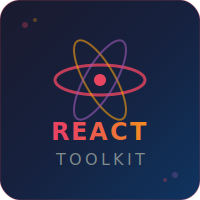

<div align="center">
  
</div>

# React Toolkit CLI 🚀

[](https://badge.fury.io/js/toolkit-react-cli)
[](https://opensource.org/licenses/MIT)
[](https://reactjs.org/)

A simple React project generator CLI that creates React projects with everything you need: axios, react-router-dom, Tailwind CSS, and helpful utilities - all configured and ready to go!

## 🚀 Quick Start

### Create a New Project

```bash
npx toolkit-react-cli my-awesome-app
cd my-awesome-app
npm run dev
```

### Install in Current Directory

```bash
npx toolkit-react-cli ./
npm run dev
```

That's it! Your React project is ready with everything configured! 🎉

## 🎯 What You Get

### ⚡ **Instant Setup**
- **React + Vite** - Fast development and build
- **Tailwind CSS** - Pre-configured utility-first CSS
- **axios** - For HTTP requests
- **react-router-dom** - For routing
- **react-toastify** - For notifications
- **OnSuccess/OnError** - Utility functions
- **Backend Proxy** - API proxy to localhost:5000

### 📁 **File Structure**
```
my-app/
├── public/              # Static files
├── src/
│   ├── components/      # Your React components
│   ├── pages/          # Your pages
│   ├── utilities.js    # OnSuccess, OnError helpers
│   ├── App.jsx         # Main app component
│   └── main.jsx        # Entry point
├── package.json        # All dependencies included
├── vite.config.js      # With proxy config
└── README.md           # Project documentation
```

### 📦 **Pre-configured Dependencies**
```json
{
  "dependencies": {
    "react": "^19.1.0",
    "react-dom": "^19.1.0",
    "axios": "^1.10.0",
    "react-router-dom": "^7.6.2",
    "react-toastify": "^11.0.5"
  }
}
```

## 💡 Usage Examples

### 🔔 **Notifications**
```jsx
import { OnSuccess, OnError } from './utilities';

// Success notification
OnSuccess('Data saved successfully!');

// Error notification  
OnError('Something went wrong!');
```

### 🌐 **HTTP Requests with Proxy**
```jsx
import axios from 'axios';

// Automatically proxies to localhost:5000
const users = await axios.get('/api/users');
const result = await axios.post('/api/login', { email, password });
```

### 🧭 **Routing**
```jsx
import { BrowserRouter, Routes, Route } from 'react-router-dom';

function App() {
  return (
    <BrowserRouter>
      <Routes>
        <Route path="/" element={<Home />} />
        <Route path="/about" element={<About />} />
      </Routes>
    </BrowserRouter>
  );
}
```

### 🎨 **Tailwind CSS**
```jsx
function Button() {
  return (
    <button className="bg-blue-500 hover:bg-blue-700 text-white font-bold py-2 px-4 rounded">
      Click me
    </button>
  );
}
```

## 🔧 **Backend Integration**

Vite proxy is pre-configured to forward API requests:

```javascript
// vite.config.js (already configured)
server: {
  proxy: {
    '/api': {
      target: 'http://localhost:5000',
      changeOrigin: true,
      secure: false,
      rewrite: (path) => path.replace(/^\/api/, '')
    }
  }
}
```

Start your backend on port 5000 and you're ready to go!

## 🛠️ **Available Scripts**

After creating your project:

```bash
npm run dev      # Start development server (port 3000)
npm run build    # Build for production  
npm run preview  # Preview production build
npm run lint     # Run ESLint
```

## 🌟 **Why React Toolkit CLI?**

### ❌ **Before (Manual Setup)**
```bash
npm create vite@latest my-app -- --template react
cd my-app
npm install
npm install axios react-router-dom react-toastify tailwindcss
# Configure Tailwind...
# Configure Vite proxy...
# Set up routing...
# Create utility functions...
```

### ✅ **After (React Toolkit CLI)**
```bash
npx toolkit-react-cli my-app
cd my-app
npm run dev
```

**Everything just works!** ⚡

## 🎯 **Perfect For**

- 🚀 **Rapid Prototyping** - Start building immediately
- 📚 **Learning React** - Focus on code, not configuration
- 👥 **Team Projects** - Consistent setup across developers
- 🏗️ **MVPs** - Get from idea to working app fast
- 🎓 **Tutorials** - Skip the boring setup stuff

## 🤝 **Contributing**

1. Fork the repository
2. Create your feature branch (`git checkout -b feature/amazing-feature`)
3. Commit your changes (`git commit -m 'Add amazing feature'`)
4. Push to the branch (`git push origin feature/amazing-feature`)
5. Open a Pull Request

## 📄 **License**

MIT © [Tushar Parlikar](https://github.com/TusharParlikar)

## 🙏 **Support**

- 📧 Email: tparlikar497@gmail.com
- 🐙 GitHub: [@TusharParlikar](https://github.com/TusharParlikar)
- 🐦 Twitter: [@tusharp497](https://x.com/tusharp497)

---

<div align="center">

**Made with ❤️ for the React community**

*Happy coding! 🎉*

</div>
